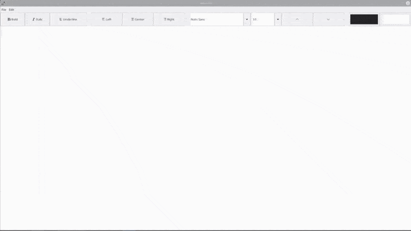

# Text Editor

### Text editor is written by using wxWidgets.

Editor supports bold, italic, underline text, alignments, font and size changing, font color and background color changing.
Can save formatting into file with xml format.

